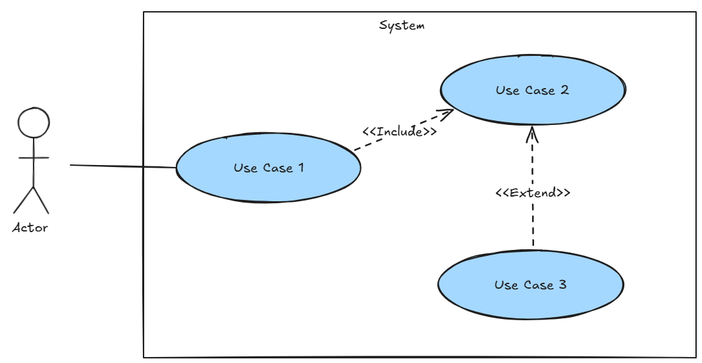

# Use Case Analysis of Pac-Man

In this activity, we'll be focusing on understanding use case diagram analysis through the analysis of the classic Pac-Man game. You'll identify the different use cases that occur in a system, understand the roles of each actor, and represent these relationships visually using a use case diagram. This exercise will help you gain practical skills in analysing system requirements and modelling interactions between different parts of a system.

**Learning Outcomes**

- Identify and define system requirements through use case analysis.
- Work in groups to analyse and define use cases, ensuring they align with functional requirements.
- Create a use case diagram to represent interactions between actors and use cases for a system.

**Time**

90 minutes.

**Resources**

- Whiteboard or paper.
- https://freepacman.org/

### Instructions

1. Form groups of 2 or 3 students.
2. Complete the tasks below to analyse the Pac-Man game to identify the use cases and create a use case diagram. 
   1. Identify the use cases
   2. Create the use case diagram
   3. Present the use case diagram to the class.

**IMPORTANT**: Use a white board or large piece of paper to brainstorm the use case. Just use your computer to play Pac-man.

### What is a Use Case?

A use case describes the actions that users take on a system. A use case diagram includes users (actors), use cases and the relationship between the two withing the system. Use case diagrams help define the system's scope, clarify requirements, and communicate functionality to stakeholders.

### Pac-Man 

Pac-Man, developed by Namco and first released in 1980. Pac-Man is a classic action maze-chase video game where players navigate the pac-man character through an enclosed maze filled with dots. The main objective is to eat all the dots while avoiding the four coloured ghosts—Blinky (red), Pinky (pink), Inky (cyan), and Clyde (orange)—who actively pursue Pac-Man. Clearing all dots advances the player to the next level, represented by a series of fruit icons at the bottom of the screen. In between levels are short cutscenes featuring Pac-Man and Blinky in humorous, comical situations.

If a ghost catches Pac-Man, a life is lost, and the game ends when all lives are depleted. Each ghost is programmed with unique artificial intelligence (A.I.) that gives them distinct behaviours: Blinky chases Pac-Man directly and relentlessly, Pinky and Inky try to cut him off by positioning themselves ahead of his path, and Clyde alternates between chasing Pac-Man and wandering away unpredictably.

The maze includes four large, flashing power pellets placed near its corners. When Pac-Man consumes one, the ghosts temporarily turn blue, displaying a dizzied expression as they reverse direction. In this state, Pac-Man can eat them for extra points. After being eaten, a ghost’s eyes return to the centre of the maze, where it regenerates and resumes its normal pursuit. Eating multiple blue ghosts in succession rewards increasing points, but the blue state only lasts for a limited time and ends with a flashing warning before the ghosts revert to their normal forms.

As Pac-Man progresses through the maze, eating a certain number of dots triggers the appearance of bonus items, typically fruit, under the centre box, which can be consumed for additional points. Two warp tunnels positioned at the maze’s sides allow Pac-Man and the ghosts to move instantly between opposite ends of the screen, though ghosts slow down when passing through these tunnels, offering strategic opportunities for the player (Wikipedia Contributors, 2019).

Have a go at a free online [Pac-Man](https://freepacman.org/),  this version demonstrates most of the functionality of the original game in an online format.

### Tasks

#### Task 1: Identify Use Cases

Review the Pac-Man gameplay and identify all key interactions between users (actors) and a system. 

##### Step 1: Define System Scope and Boundaries

Discuss the core purpose of the system’s and its boundaries and write a one or two sentence description. For example, An online bookstore system will allow customers to browse, search for, and purchase books online. It will also provide an admin interface for managing the inventory, processing orders, and handling customer inquiries.

*Questions to consider:*

- *What are the core functionalities of this system?*
- *What is explicitly outside the system’s responsibilities?*

##### Step 2: Identify Actors

List all the actors who interact with the system, including both human users and external systems. 

*Questions to consider:*

- W*ho will use the system?*
- *What external systems will interact with it?*

##### Step 3: Define Actor Goals

For each actor, identify their main goals when interacting with the system. For example, in an online shop a Customer may want to "Place an order" or "Track a shipment".

##### Step 4: Identify Use Cases based on Actor Goals

For each actor goal, identify the specific use cases required to achieve that goal. Use cases should represent actions or tasks that directly help actors accomplish their objectives. For example, for the goal  "Place an order" the use case may be "Place Order" other use cases to achieve the goal could be "Log in" or "Create Account". Break down each goal into separate use cases as needed to make them manageable and clear.

##### Step 5: Identify Triggers for each Use Case

Determine what initiates each use case, whether it’s an actor action, i.e. the user clicks "Checkout" or an automated system event fires.

##### Step 6: Define Preconditions

For each use case, specify any preconditions that must be true before it can begin. These could include required data, permissions, or system states (e.g., "User must be logged in" or "Item must be in stock").

##### Step 7: Develop Primary and Alternative Flows

For each goal, create a list of possible interactions between the actors and the system to achieve each identified goal. Write scenarios that capture the primary way to achieve the goal, along with alternative scenarios where things might go differently. 

Example Use Case: Complete a Purchase

**Primary Flow:**

1. Customer browses or searches for a book.
2. Customer views the book’s details and adds it to the cart.
3. Customer proceeds to checkout, reviews items in the cart, and confirms.
4. Customer enters shipping and payment information.
5. System validates the payment and confirms the order.
6. Customer receives an order confirmation and estimated delivery date.

**Alternative Flows**:

- Invalid Payment Details
  - If payment fails: 
    - System prompts the customer to re-enter payment details.

##### Step 7: Specify Postconditions

Define the postconditions for each use case, describing the expected system state after successful completion

##### Step 8: Review and Consolidate Use Cases

Review your use case list to consolidate any redundant or overly similar use cases.

### Task 2: Create Use Case Diagram

Draw a use case diagram that represents the identified use cases and their relationships with the actors. Use appropriate notations to show the connections between

##### Key Components of a Use Case Diagram

- **Actors**: These represent the people, organisations, external systems, or devices that interact with the system. Actors are typically users of the system or other systems that interact with the system being modeled. They are represented by stick figures.
- **Use Cases**: These are the specific actions or functions that the system performs to fulfill the goals of actors. Each use case represents a specific functionality that provides value to the actor(s). They are represented as ovals or ellipses.
- **System Boundary**: This is a box or rectangle that defines the scope of the system. All use cases are placed inside this boundary, while actors are positioned outside. It helps to distinguish what is within the system and what interacts with it externally.

##### Relationships

- **Association**: This is a solid line that connects an actor to a use case, indicating that the actor is involved in or interacts with that use case.
- **Include**: This relationship is shown as a dashed arrow from one use case to another and signifies that the behaviour of the included use case is a required part of the base use case. The included use case cannot stand alone and is always called by the base use case..
- **Extend**: Also shown as a dashed arrow from one use case to another, an *extend* relationship indicates optional or conditional behaviour. The base use case can function independently, but under certain conditions, the extended use case may also execute.
- **Generalization**: Shown as a line with a hollow arrowhead, this relationship represents inheritance, where one actor or use case inherits the characteristics of another. It’s used to show specialisation. For actors, this means one actor can use another actor’s use cases

### Task 3: Present the Use Case Diagram

Present your use case diagram to the rest of the class. 

Focus on explaining the core use cases, actors, and how they interact within the game context.

*Questions to consider*

- *How does creating use cases help in understanding the system requirements for the Pac-Man game?*
- *How would the system need to change if we added a new type of power-up with different effects?*

### References

Wikipedia Contributors. (2019, September 10). Pac-Man. Wikipedia; Wikimedia Foundation. https://en.wikipedia.org/wiki/Pac-Man